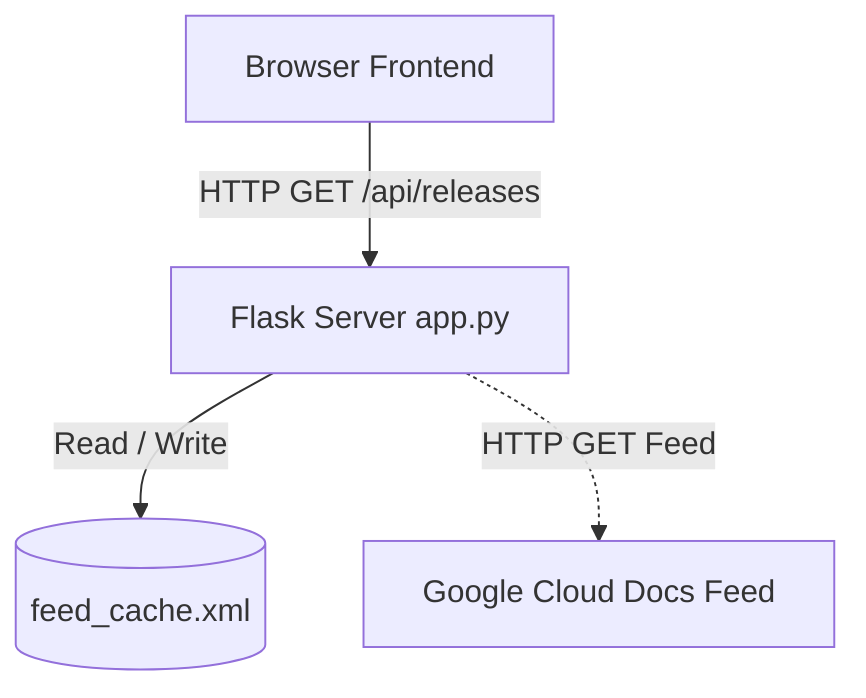
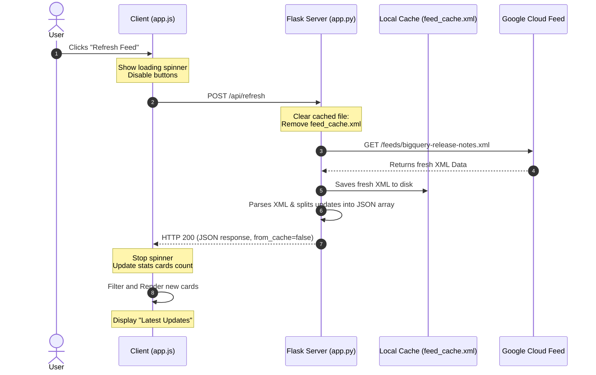
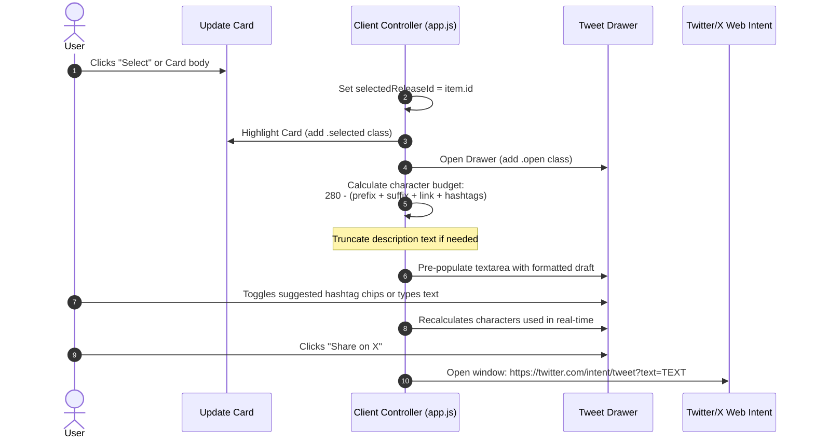

# BigQuery Release Notes Tracker & Broadcaster: Architecture & Data Flow

This document provides a detailed architectural breakdown of the BigQuery Release Notes Web Application. It explains the core features, splits the codebase into Server-Side and Client-Side, and walks through the request-response cycle of key user actions.

---

## 1. Project Overview & Core Features

The project is a lightweight, responsive dashboard designed to fetch, parse, search, and distribute Google BigQuery release notes. It consists of the following key features:

*   **Live XML Ingestion:** Fetches the official Google Cloud Atom feed (`/feeds/bigquery-release-notes.xml`) in real-time.
*   **Granular Update Splitting:** Instead of displaying entire multi-entry dates as single blocks, the backend parses the HTML content and splits updates by their type headers (`<h3>` tags), turning each individual feature, change, or bug fix into its own searchable card.
*   **Server-Side Caching:** Caches the feed locally for **1 hour** to keep response times ultra-fast and prevent hitting Google's servers on every load. Includes fallback retrieval on connection issues.
*   **Interactive Search & Filter:** Instantly filters cards on the client side using text search or type-specific filters (Features, Changes, Issues, Deprecations).
*   **Stats Dashboard:** Automatically tallies and displays counts of each update type.
*   **Twitter/X Broadcaster:** Automatically formats select release notes for sharing. It provides a sliding **Tweet Composer Drawer** that tracks length (280-character limit), auto-trims description text, and dynamically appends hashtag chips.

---

## 2. Codebase Breakdown

### A. Server-Side (Python Flask)
The backend is contained in [app.py](file:///D:/Kaggle%205day%20aiagents%20+%20vibe%20coding/Day%202/agy-cli-projects/bq-releases-notes/app.py) and operates statelessly, serving static assets and exposing two REST API endpoints.

*   **Caching Layer (`fetch_feed_data()`):**
    *   Checks if `feed_cache.xml` exists and is less than 3600 seconds (1 hour) old.
    *   If valid, returns cached data.
    *   If expired or missing, performs a `urllib.request` fetch to Google and writes the fresh XML back to the cache.
    *   On network failure, falls back to the expired cache file to guarantee uptime.
*   **Feed Parser (`parse_xml_to_releases()`):**
    *   Parses the XML string using `xml.etree.ElementTree`.
    *   Extracts each `<entry>` block.
    *   Using Regex (`re.split`), it splits the `<content>` HTML on `<h3>` tags. It maps each HTML section to its preceding header (e.g. `Feature`, `Change`, `Issue`) to create individual JSON objects.
    *   Strips HTML tags to create a raw string representation (`text`) used for searching and character-count calculations.
*   **Endpoints:**
    *   `GET /`: Renders the index HTML page.
    *   `GET /api/releases`: Returns the parsed JSON list of release notes (served from cache if available).
    *   `POST /api/refresh`: Deletes the cached file, fetches fresh data from Google, and returns the newly parsed JSON list.

### B. Client-Side (HTML, CSS, JavaScript)
The frontend uses standard, framework-free web technologies styled with modern dark/light themes.

*   **User Interface ([index.html](file:///D:/Kaggle%205day%20aiagents%20+%20vibe%20coding/Day%202/agy-cli-projects/bq-releases-notes/templates/index.html)):**
    *   Implements semantic elements (`<header>`, `<main>`, `<section>`, `<aside>`).
    *   Contains the stats cards layout, search bar, and filter chips.
    *   Hosts the **Tweet Composer Drawer** (`#tweet-drawer`), which slides out using CSS transitions.
*   **Styling System ([style.css](file:///D:/Kaggle%205day%20aiagents%20+%20vibe%20coding/Day%202/agy-cli-projects/bq-releases-notes/static/style.css)):**
    *   Implements a custom theme system using CSS custom properties (variables) toggled via the `.dark-theme` / `.light-theme` class on `<body>`.
    *   Defines tag colors for Features (emerald), Changes (blue), Issues (amber), and Deprecations (red).
    *   Uses responsive grid layout and CSS media queries to slide the drawer from the right on desktops, and up from the bottom on mobile screens.
*   **Controller ([app.js](file:///D:/Kaggle%205day%20aiagents%20+%20vibe%20coding/Day%202/agy-cli-projects/bq-releases-notes/static/app.js)):**
    *   Stores active state: `releases` (all data), `filteredReleases` (active subset), `activeTypeFilter` (chip state), `searchQuery` (search state), `selectedReleaseId` (selected card).
    *   Renders list elements dynamically using template literals.
    *   Tracks theme changes and persists them to `localStorage`.
    *   Tracks selected cards, opens the composer, and monitors character counts.

---

## 3. Sample Flow: Refreshing the Feed

This flow outlines what happens when a user clicks the "Refresh Feed" button in the header.

### Detailed Sequence:
1.  **Trigger:** The user clicks the **Refresh Feed** button.
2.  **UI Feedback:** `app.js` catches the click, adds the `.loading` class to the refresh icon (starting the CSS spin animation), and disables the button to prevent double clicks. It displays the `#loading-state` skeleton.
3.  **API Call:** `app.js` issues a `POST` request to `/api/refresh`.
4.  **Cache Clearance:** The Flask server (`app.py`) catches the `POST` request and deletes `feed_cache.xml` if it exists.
5.  **Data Ingestion:** The server sends a HTTP request with a mock browser User-Agent to Google Cloud. Google responds with the XML data.
6.  **Caching:** The server writes the XML payload to `feed_cache.xml` for future requests.
7.  **Data Parsing:** The server runs `parse_xml_to_releases(xml_data)`, returning 60+ individual release objects.
8.  **Response:** The server returns the payload with `from_cache: false`.
9.  **Rendering:** `app.js` receives the response, stops the loading animations, updates the statistics panel, applies current search/filter constraints, and generates the card elements.

---

## 4. Sample Flow: Selecting & Editing a Tweet

This flow outlines what happens when a user selects a release card to compose a tweet.

### Detailed Sequence:
1.  **Selection:** The user clicks on a card or its "Select" button.
2.  **Highlight:** `app.js` adds the `.selected` class to the clicked card (adding a blue outline and glow) and slides the drawer open using CSS transitions.
3.  **Drafting:** `app.js` retrieves the release details. It calculates the fixed character length of the link, template prefix, and default hashtags.
4.  **Trimming:** If the description text exceeds the remaining budget (out of 280 characters), it slices the text and appends `...` to ensure it fits.
5.  **Interactivity:** The user can type custom text or toggle hashtags. Any change fires the `input` event, recalculating the count and warning the user if they exceed 280 characters.
6.  **Redirect:** The user clicks "Share on X", which encodes the text and opens a secure popup pointing to the Twitter Web Intent URL.
